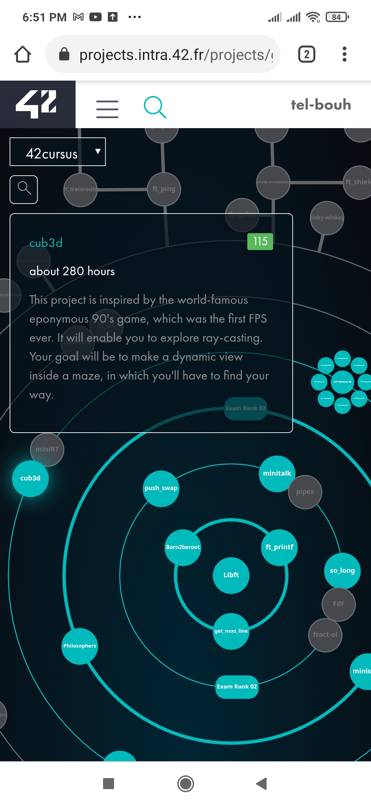

# Cub3d: the ninth pjoject in 42 cursus.

The aim of this project is create a 3D game by implementing raycasting in the help of minilibx library.

- [ Cub3d: ](#the-ninth-pjoject-in-42-cursus.)
  - [Table of contents](#table-of-contents)
  - [Overview](#overview)
  - [The project](#the-project)
  - [Screenshot](#screenshot)
  - [Screenshot](#screenshot)

## Overview

This project is inspired by the world-famous Wolfenstein 3D game, which
was the first FPS ever. It will enable you to explore ray-casting. Your goal will be to
make a dynamic view inside a maze, in which you’ll have to find your way.

### The project

This project’s objectives are similar to all this first year’s objectives: Rigor, use of C, use
of basic algorithms, information research etc.
As a graphic design project, cub3D will enable you to improve your skills in these
areas: windows, colors, events, fill shapes, etc.

To conclude cub3D is a remarkable playground to explore the playful practical appli-
cations of mathematics without having to understand the specifics.

With the help of the numerous documents available on the internet, you will use
mathematics as a tool to create elegant and efficient algorithms.

### Requirement

The game use minilibx library, the link bellow is a guide to install it correctly.
https://harm-smits.github.io/42docs/libs/minilibx/getting_started.html

### Screenshot

